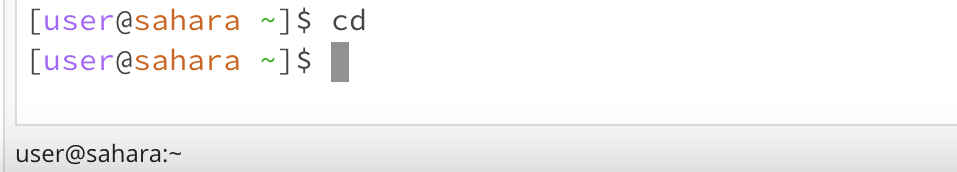
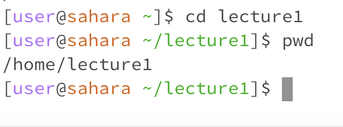
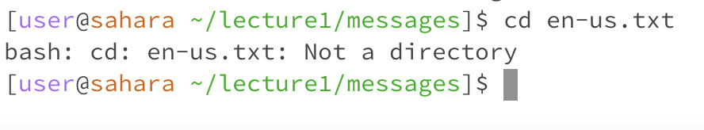
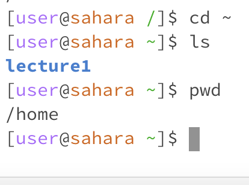
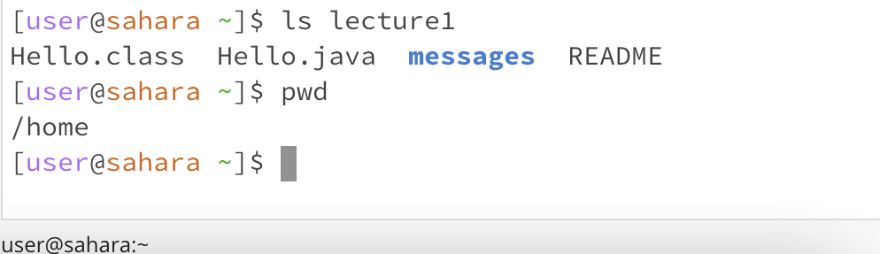
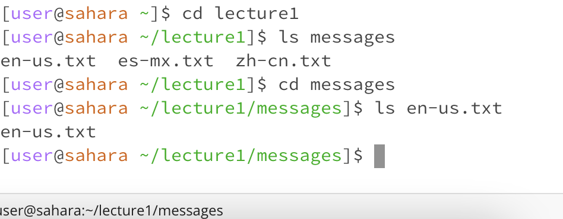
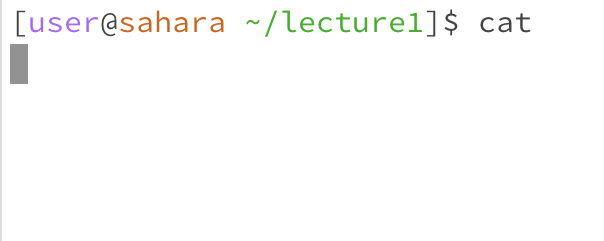
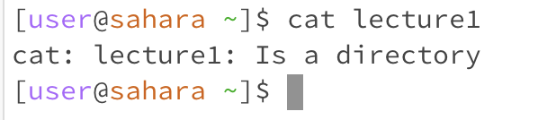
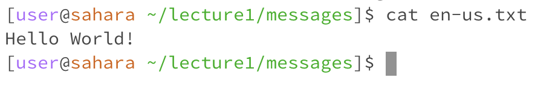

# Lab Report 1
## CD command

The working directory here was /home. There is no error in this output, there are simply no arguments for the system to "change directory" to.

The working directory here is /home/lecture1. There is no error in this output. Here we changed the directory from /home to /home/lecture1.

I was able to cd to the messages directory to access a file. However, cd to a file is an error because a file is not a directory. My working directory here was /home/lecture1/messages
## LS command

With no arguments, ls simply lists out the names of the files and folders inside the current work directory, which is home. There is no error here.

This lists the files and folders inside the directory of lecture1. The working directory here is still /home and there are no errors.

I changed directory to lecture1, then to messages, to be able to access a file in that directory. Using ls on the file: en-us.txt produced the contents in that file which was just the file itself. There is no error here and the working directory is /home/lecture1/messages.
## CAT command

This is basically somewhat of an error. The cat command needs to have two inputs to be able to concatenate and print the contents of one or more files given by the paths. Since there are no paths specified in this command, there is no output. I used the working directory of /home/lecture1.

This is basically an error message because to be able to use cat, we would be concatenating two files, not directories. So this is invalid input. My working directory here was /home. 

Here I used cat on a file, which printed out the contents of that file. There is no error here, and my working directory is /home/lecture1/messages.
