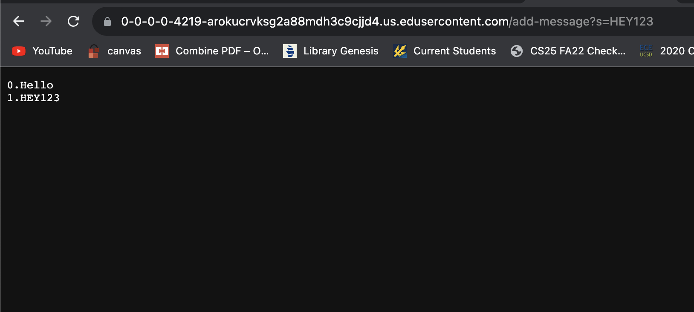
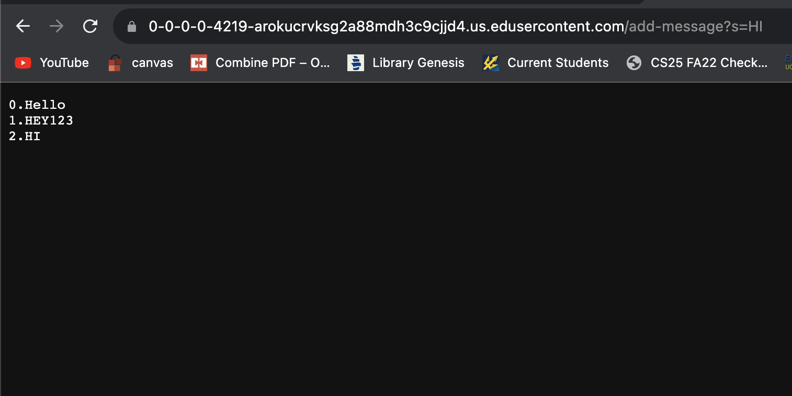
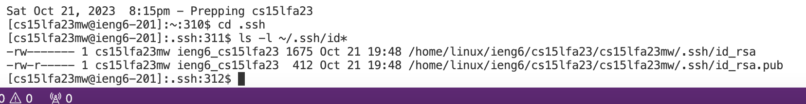
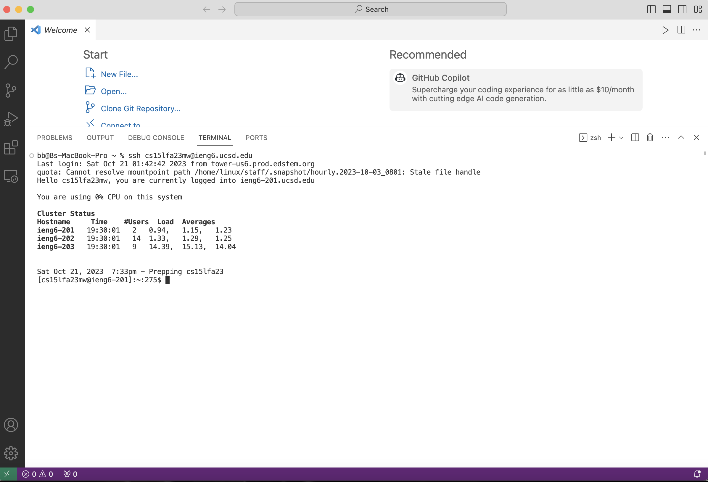

#Part 1
```
import java.io.IOException;
import java.net.URI;

class Handler implements URLHandler {
    // The one bit of state on the server: a number that will be manipulated by
    // various requests.
        String[] array = new String[100];
        int count = 0;
        String abc = "";
    public String handleRequest(URI url) {
        
        if (url.getPath().equals("/")) {
            return "input a path!";
        }
        else if (url.getPath().equals("/add-message")) {
            String[] parameters = url.getQuery().split("=");
            array[count] = String.format("%d", count) + "."+ parameters[1] + "\n";
             
             //for( int i = 0; i <= count; i++ ){
            abc = abc + array[count]; 
            //}
            count++;
            return abc;
        }
        else {
            return "404 Not Found!";
        }
    }
}


class StringServer {
    public static void main(String[] args) throws IOException {
        if(args.length == 0){
            System.out.println("Missing port number! Try any number between 1024 to 49151");
            return;
        }

        int port = Integer.parseInt(args[0]);

        Server.start(port, new Handler());
    }
}
```



Which methods in your code are called?

*String.format* is a method that returns a formatted string using the given locale and specified format string and arguments. *.getPath()" is another method that that returns the path of the given file object. 
*.equals" is a method that compares strings to find out if they are equal. *.getQuery()* is a function method that returns the Query of a specified URI. *.split* will break a given string around matches of the given 
regular expression, such as = as used in the code.

What are the relevant arguments to those methods, and the values of any relevant fields of the class?

*.format* will take the arguments of another variable type and convert it into a string. *.getPath()* and *.getQuery()* do not take in arguments. *.equals* takes in the argument of a string and compares it to the input to see
if those strings are equal. *.split* will take an expression as an argument and break code around it. 

How do the values of any relevant fields of the class change from this specific request? If no values got changed, explain why.

*String.format* will change the argument values into strings. *getPath()* and *.getQuery()* will not change any values, because they only recieve values. *.equals* will not change any values because it is a method used to compare. 
*.split* will change values of the string in our path by splitting them.

#Part 2
Both of my screenshots include the paths to both the private and public keys. *.pub* denotes the public key, and the path that does not end in *.pub* denotes the path to the private key.

The path to the private key for your SSH key for logging into ieng6 (on your computer or on the home directory of the lab computer):
/home/linux/ieng6/cs15lfa23/cs15lfa23mw/.ssh/id_rsa


The path to the public key for your SSH key for logging into ieng6 (within your account on ieng6):
/home/linux/ieng6/cs15lfa23/cs15lfa23mw/.ssh/id_rsa



A terminal interaction where you log into ieng6 with your course-specific account without being asked for a password.



#Part 3

Week 3 I can definitely say that I learned a lot, and spent a lot of time learning it. I do not have experience with java, and learning how to write the code for this week's lab Part 1 was definitely a struggle, but I did learn a lot. I also learned about what SSH is and how to access it and to create an authorized key for myself via vscode so that I wouldn't have to enter in my password when I log in there.
