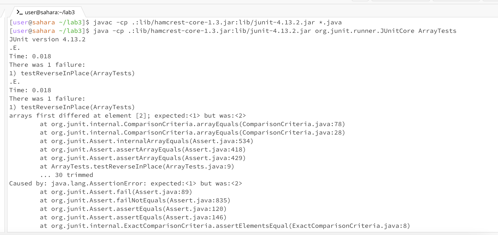
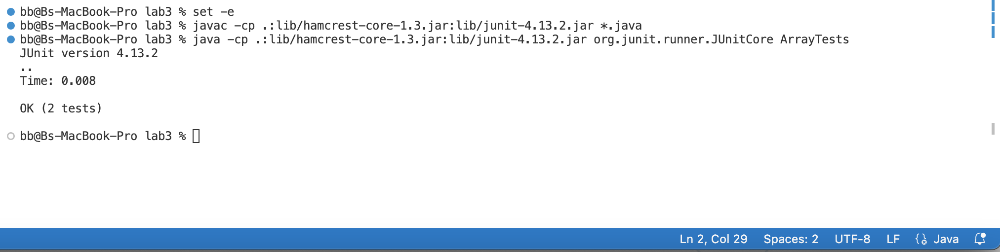

# Part1-Bugs
## The Failure Inducing Input for the Buggy Program:
```
import static org.junit.Assert.*;
import org.junit.*;

public class ArrayTests {
	@Test 
	public void testReverseInPlace() {
    int[] input1 = { 1,0,2,3 };
    ArrayExamples.reverseInPlace(input1);
    assertArrayEquals(new int[]{ 3,2,1,0 }, input1);
	}


  @Test
  public void testReversed() {
    int[] input1 = { };
    assertArrayEquals(new int[]{ }, ArrayExamples.reversed(input1));
  }
}
```
## The Corresponding Code to the Failure Inducing Input
```
public class ArrayExamples {

  // Changes the input array to be in reversed order
  static void reverseInPlace(int[] arr) {
    for(int i = 0; i < arr.length; i += 1) {
      arr[i] = arr[arr.length - i - 1];
    }
  }

  // Returns a *new* array with all the elements of the input array in reversed
  // order
  static int[] reversed(int[] arr) {
    int[] newArray = new int[arr.length];
    for(int i = 0; i < arr.length; i += 1) {
      arr[i] = newArray[arr.length - i - 1];
    }
    return arr;
  }

  // Averages the numbers in the array (takes the mean), but leaves out the
  // lowest number when calculating. Returns 0 if there are no elements or just
  // 1 element in the array
  static double averageWithoutLowest(double[] arr) {
    if(arr.length < 2) { return 0.0; }
    double lowest = arr[0];
    for(double num: arr) {
      if(num < lowest) { lowest = num; }
    }
    double sum = 0;
    for(double num: arr) {
      if(num != lowest) { sum += num; }
    }
    return sum / (arr.length - 1);
  }


}

```
## Input That Doesn't Induce a Failure
```
import static org.junit.Assert.*;
import org.junit.*;

public class ArrayTests {
	@Test 
	public void testReverseInPlace() {
    int[] input1 = {3,0 };
    ArrayExamples.reverseInPlace(input1);
    assertArrayEquals(new int[]{0,3}, input1);
	}
}
```
## Code for Successful Test Output
```
public class ArrayExamples {

  // Changes the input array to be in reversed order
  static void reverseInPlace(int[] arr) {
    for(int i = 0; i < arr.length/2; i += 1) {
      int Temp = arr[i];
      arr[i] = arr[arr.length - i - 1];
      arr[arr.length - i - 1] = Temp;
    }
  }

  // Returns a *new* array with all the elements of the input array in reversed
  // order
  static int[] reversed(int[] arr) {
    int[] newArray = new int[arr.length];
    for(int i = 0; i < arr.length; i += 1) {
      newArray[i] = arr[arr.length - i-1];
    }
    return newArray;
  }

  // Averages the numbers in the array (takes the mean), but leaves out the
  // lowest number when calculating. Returns 0 if there are no elements or just
  // 1 element in the array
  static double averageWithoutLowest(double[] arr) {
    if(arr.length < 2) { return 0.0; }
    double lowest = arr[0];
    for(double num: arr) {
      if(num < lowest) { lowest = num; }
    }
    double sum = 0;
    for(double num: arr) {
      if(num != lowest) { sum += num; }
    }
    return sum / (arr.length - 1);
  }


}
```
## Screenshots of Running JUnit




## The Fix
In the reversed method, we have an output failure by recieving all 0's in our returned array instead of the expected reversed array. The issue is that the elements are not being copied from the original array to the new array, they are instead being copied from the new array to the old
array. Our new array was never assigned any values so the returned array is just all 0's. To fix this, I assigned the elements of the new array to be the elements of the original array in reverse order
and return this new array, not the array that was orginially inputed.

In the reverseInPlace method, I changed the domain of the for loop to half of the length of the original array, because in the original code, `arr[i]` is looping through itself and assigning these new reversed values to itself so if the array was [1,2,3,4], it would return a reversed array of [4,3,3,4]. Which
is not what we want. So instead, I changed that domain of the loop to half of the length of the array and I also had to create a temporary variable which would store the variable from the original array that is being lost during the reversing process. Our temporary variable would be set to equal the first index of the original array.
We would set that value equal to the last index of the changed array. Then the temp variable is reset to contain the second variable of the original array, and then we set that value equal to the second to last index of our reversed array. This process is repeated until the loop ends.

# Part 2- Researching
I chose the command `less` to research. `Less` allows us to read text files one screen at a time and also provides us with navigation through what is displayed on the screen. Pressing q allows us to exit the `less ` and get back into the normal terminal.

## Command1: less -S
`less -S` allows us to access the specified contents of the file, but we will see that the long lines of the file are chopped if they do not fit within the width of the terminal, instead of being wrapped to the next line like we normally see. 
This would be useful for files with long lines which would allow you to see the full content of each line without the line wrapping. 

Example 1:
Commands:
```
cd technical
cd 911report
less -S chapter-1.txt
```
Output:
```              
"WE HAVE SOME PLANES"

    Tuesday, September 11, 2001, dawned temperate and nearly cloudless in the eastern United States. Millions of men and women readied the>

    For those heading to an airport, weather conditions could not have been better for a safe and pleasant journey. Among the travelers we>

INSIDE THE FOUR FLIGHTS

Boarding the Flights

    Boston: American 11 and United 175. Atta and Omari boarded a 6:00 A.M. flight from Portland to Boston's Logan International Airport.

    When he checked in for his flight to Boston, Atta was selected by a computerized prescreening system known as CAPPS (Computer Assisted>
```
Example 2:
Commands:
```
cd biomed
less -S 1468-6708-3-1.txt
```
Output:
```
 Introduction
        Older adults are frequently counseled to lose weight,
        even though there is little evidence that overweight is
        associated with increased mortality in those over age 65.
        Six large controlled population-based studies of
        non-smoking older adults have investigated the association
        between body mass index (BMI) and mortality, controlling
        for relevant covariates [ 1 2 3 4 5 6 ] . All studies found
        excess risk for persons with very low BMI, but that persons
        with moderately high BMI had little or no extra risk except
        in certain small subsets. A review of 13 studies of older
        adults drew similar conclusions [ 7 ] .
        Many healthy older adults report gradual weight gain
        throughout adult life. It may be that a small amount of
        gradual weight gain is normative and associated with the
        most robust health as we age. It has been suggested that
        weight standards be adjusted upwards for age [ 8 ] . Such
        recommendations remain controversial, however, because the
        number of studies of older persons is fairly small, and
        because few studies have examined the relation of BMI to
```

## Command2: less -F
The command `less -F` allows us to exit out of the less method if the file is small enough to fit onto one screen. This is handy because we wouldnt have to exit out of the less program if our file has very little contents in it and there is no reason to enter less if we can 
just see everything in the terminal easily. Example 3 did not exit back to terminal because the file contents did not fit on one screen, however, Example 4's file had only 46 lines, and once I ran the command, it displayed the file 
contents in the terminal and I was already back in the terminal without having to press q. 

Example 3:
Commands: 
```
cd biomed
less -F 1468-6708-3-1.txt
```
Output:
```
 Introduction
        Older adults are frequently counseled to lose weight,
        even though there is little evidence that overweight is
        associated with increased mortality in those over age 65.
        Six large controlled population-based studies of
        non-smoking older adults have investigated the association
        between body mass index (BMI) and mortality, controlling
        for relevant covariates [ 1 2 3 4 5 6 ] . All studies found
        excess risk for persons with very low BMI, but that persons
        with moderately high BMI had little or no extra risk except
        in certain small subsets. A review of 13 studies of older
        adults drew similar conclusions [ 7 ] .
        Many healthy older adults report gradual weight gain
        throughout adult life. It may be that a small amount of
        gradual weight gain is normative and associated with the
        most robust health as we age. It has been suggested that
        weight standards be adjusted upwards for age [ 8 ] . Such
        recommendations remain controversial, however, because the
        number of studies of older persons is fairly small, and
        because few studies have examined the relation of BMI to
        quality of life or years of healthy life (YHL) in the
        elderly [ 9 ] .
```
Example 4:
Commands:
```
cd plos
less -F pmed.0020090.txt  
```
Output:
```
        What is the level of medical evidence that should be used to inform medical practice? At
        the bottom of the hierarchy of evidence are anecdotes, expert opinion, case reports, and
        case series, and at the top is the systematic review of published (and sometimes
        unpublished) evidence. By necessity, systematic reviews come many years after hypotheses
        are first raised, and in the interim recommendations for practice may sway back and forth.
        One example of this is the debate over the role of uric acid in heart disease, which has
        been going on for more than 50 years. It started with a paper published in 1951 in the 
        Annals of Internal Medicine that found higher serum uric acid
        concentrations in patients with coronary heart disease (CHD) compared with controls. Since
        then, measurement of serum uric acid has been suggested as a predictor of CHD. But many of
        the studies on serum uric acid are epidemiologic studies—somewhere in the middle of the
        hierarchy of evidence—and have come to different conclusions about how useful measurement
        of uric acid is.
        Dissecting out the role of uric acid is further complicated by three things: high levels
        of uric acid are associated with hypertension and being overweight (other risk factors for
        CHD); levels of uric acid can be altered by drugs such as diuretics that people with CHD
        often take; and finally, alteration of renal function can affect uric acid levels. Another
        problem is the type of studies that have been used to address the question of uric acid's
        role in CHD. Retrospective studies may be unable to control adequately for other risk
        factors—hence prospective, ideally population-based, studies would be the best to answer
        the question of whether there really is an association between high uric acid and CHD.
        In this month's 
        PLoS Medicine , John Danesh and colleagues from the University of
        Cambridge, along with investigators from the Icelandic Heart Association, report the single
        largest prospective study addressing the role of uric acid in heart disease. Further, their
        systematic review combines their findings with those of 15 previously published prospective
        studies of serum uric acid—9,458 cases of CHD and 155,084 controls in all.
        The paper answers the question of the role of uric acid in prediction of CHD clearly:
        the risk ratio for prediction of disease was 1.13 (1.07–1.20), but it was only 1.02
        (0.91–1.14) in the eight studies that had the most complete adjustment for possible
        confounders. What this paper does not do is directly address the question of whether or not
        serum uric acid is involved in causing CHD through intermediates; however, it does suggest
        that serum uric acid levels are unlikely to be a major determinant of CHD.
        Where does such a result leave patients? Well, it is likely that improving diet, losing
        weight, and controlling blood pressure may all contribute to reducing both one's risk of
        CHD and one's serum levels of uric acid. The role of uric acid in CHD is now likely to be
        of interest only to those studying basic science; for now, the clinical question seems
        closed.
```

## Command3: less +N
`less +N` where N is a number value, allows us to open the `less` program and to be able to start reading from the specified N line. Example 6's file had 599 lines, but `less +N` allowed me to 
start reading from line 585 where I could just read about the last passage in the file about Waste Disposal.

Example 5:
Input:
```
cd plos
less +15 pmed.0020090.txt
```
Output:
```
then, measurement of serum uric acid has been suggested as a predictor of CHD. But many of
        the studies on serum uric acid are epidemiologic studies—somewhere in the middle of the
        hierarchy of evidence—and have come to different conclusions about how useful measurement
        of uric acid is.
        Dissecting out the role of uric acid is further complicated by three things: high levels
        of uric acid are associated with hypertension and being overweight (other risk factors for
        CHD); levels of uric acid can be altered by drugs such as diuretics that people with CHD
        often take; and finally, alteration of renal function can affect uric acid levels. Another
        problem is the type of studies that have been used to address the question of uric acid's
        role in CHD. Retrospective studies may be unable to control adequately for other risk
        factors—hence prospective, ideally population-based, studies would be the best to answer
        the question of whether there really is an association between high uric acid and CHD.
        In this month's 
        PLoS Medicine , John Danesh and colleagues from the University of
        Cambridge, along with investigators from the Icelandic Heart Association, report the single
        largest prospective study addressing the role of uric acid in heart disease. Further, their
        systematic review combines their findings with those of 15 previously published prospective
        studies of serum uric acid—9,458 cases of CHD and 155,084 controls in all.
        The paper answers the question of the role of uric acid in prediction of CHD clearly:
        the risk ratio for prediction of disease was 1.13 (1.07–1.20), but it was only 1.02
        (0.91–1.14) in the eight studies that had the most complete adjustment for possible
        confounders. What this paper does not do is directly address the question of whether or not
        serum uric acid is involved in causing CHD through intermediates; however, it does suggest
        that serum uric acid levels are unlikely to be a major determinant of CHD.
        Where does such a result leave patients? Well, it is likely that improving diet, losing
        weight, and controlling blood pressure may all contribute to reducing both one's risk of
        CHD and one's serum levels of uric acid. The role of uric acid in CHD is now likely to be
        of interest only to those studying basic science; for now, the clinical question seems
        closed.
```
Example 6:
Input:
```
cd government
cd Env_Prot_Agen
less +585 1-3_meth_901.txt
```
Output:
```
WASTE DISPOSAL


3.6.1 Wastes generated during toxicity testing must be properly
handled and disposed of in an appropriate manner. Each testing
facility will have its own waste disposal requirements based on
local, state and Federal rules and regulations. It is extremely
important that these rules and regulations be known, understood,
and complied with by all persons responsible for, or otherwise
involved in, performing toxicity testing activities. Local fire
officials should be notified of any potentially hazardous
conditions.
```

## Command4: less -N
`less -N` allows us to access the file, except now each line is numbered. This would allow for better navigation and referring to lines of a file when accessing it in terminal.

Example 7:
Input:
```
cd plos
less -N journal.pbio.0030131.txt
```
Output:
```
 1 
      2   
      3     
      4       
      5         
      6         
      7           
      8             
      9               “Alchemy: a process of transforming something common into something
     10               special”—Webster's Dictionary
     11             
     12           
     13         
     14         A growing number of studies are reporting the isolation of cardiac stem cells from a
     15         variety of tissue sources and examining their effects on promoting the repair of the
     16         injured heart. In the current issue of 
     17         PLoS Biology , the storyline takes an unexpected, interesting twist, as
     18         Neal Epstein and his colleagues report the isolation of a novel cell type from skeletal
     19         muscle that can adopt a highly differentiated cardiac muscle cell phenotype in vitro and in
     20         vivo [1].
     21         In this study, the authors use a differential isolation procedure to remove the skeletal
     22         muscle cells and myoblasts (immature muscle cells), and then collect the cells that are
     23         negative for a cell-surface marker called Sca-1. Under defined in vitro conditions, these
     24         cells adopt a cardiomyocyte phenotype that goes beyond the simple expression of
     25         cardiac-restricted biochemical and molecular markers, extending to the types of single-cell
     26         physiological functions that are hallmarks of authentic cardiomyocytes, including action
     27         potentials, calcium transients, and contractile activity. They call the cells Spoc cells,
     28         an acronym for “skeletal-based precursor of cardiomyocytes.”
     29         The study goes on to show that these cells can adopt this phenotype without the addition
     30         of cytokines or agents such as azacytidine that are known to activate the muscle gene
     31         program in nonmuscle cells. The cells also adopt the cardiac phenotype following their in
     32         vivo implantation into the ischemic heart following myocardial infarction, suggesting a
     33         potential therapeutic utility for these cells. Since Spoc cells were isolated from murine
     34         skeletal muscle, they may eventually allow the use of sophisticated conditional genetic
     35         tracking techniques to monitor the migration, maturation, and differentiation of the cells
     36         in the in vivo context.
     37         Of course, a study with results this unexpected also raises a number of intriguing
     38         questions. Identifying the native location of Spoc cells, as well as the in vivo niche that
     39         insulates them from entering the differentiated cardiac program, will be valuable. A
     40         rigorous exploration of their developmental origin and their relationship to the other
     41         well-known cell types in skeletal muscle should be forthcoming. In this regard, a set of
     42         skeletal muscle stem cells, distinct from myoblasts, has also been found [2], and the
     43         question arises as to whether Spoc cells are related to these other skeletal muscle
     44         progenitors.
     45       
     46       
     47         Cardiomyocyte Precursors Abound
     48         Other studies have reported the isolation of cells that can differentiate into cardiac
     49         muscle from diverse noncardiac tissues. In vitro and in vivo studies have suggested that
```
Example 8:
Input:
```
cd plos
less -N pmed.0020090.txt
```
Output:
```
1 
      2   
      3     
      4       
      5         
      6         What is the level of medical evidence that should be used to inform medical practice? At
      7         the bottom of the hierarchy of evidence are anecdotes, expert opinion, case reports, and
      8         case series, and at the top is the systematic review of published (and sometimes
      9         unpublished) evidence. By necessity, systematic reviews come many years after hypotheses
     10         are first raised, and in the interim recommendations for practice may sway back and forth.
     11         One example of this is the debate over the role of uric acid in heart disease, which has
     12         been going on for more than 50 years. It started with a paper published in 1951 in the 
     13         Annals of Internal Medicine that found higher serum uric acid
     14         concentrations in patients with coronary heart disease (CHD) compared with controls. Since
     15         then, measurement of serum uric acid has been suggested as a predictor of CHD. But many of
     16         the studies on serum uric acid are epidemiologic studies—somewhere in the middle of the
     17         hierarchy of evidence—and have come to different conclusions about how useful measurement
     18         of uric acid is.
     19         Dissecting out the role of uric acid is further complicated by three things: high levels
     20         of uric acid are associated with hypertension and being overweight (other risk factors for
     21         CHD); levels of uric acid can be altered by drugs such as diuretics that people with CHD
     22         often take; and finally, alteration of renal function can affect uric acid levels. Another
     23         problem is the type of studies that have been used to address the question of uric acid's
     24         role in CHD. Retrospective studies may be unable to control adequately for other risk
     25         factors—hence prospective, ideally population-based, studies would be the best to answer
     26         the question of whether there really is an association between high uric acid and CHD.
     27         In this month's 
     28         PLoS Medicine , John Danesh and colleagues from the University of
     29         Cambridge, along with investigators from the Icelandic Heart Association, report the single
     30         largest prospective study addressing the role of uric acid in heart disease. Further, their
     31         systematic review combines their findings with those of 15 previously published prospective
     32         studies of serum uric acid—9,458 cases of CHD and 155,084 controls in all.
     33         The paper answers the question of the role of uric acid in prediction of CHD clearly:
     34         the risk ratio for prediction of disease was 1.13 (1.07–1.20), but it was only 1.02
     35         (0.91–1.14) in the eight studies that had the most complete adjustment for possible
     36         confounders. What this paper does not do is directly address the question of whether or not
     37         serum uric acid is involved in causing CHD through intermediates; however, it does suggest
     38         that serum uric acid levels are unlikely to be a major determinant of CHD.
     39         Where does such a result leave patients? Well, it is likely that improving diet, losing
     40         weight, and controlling blood pressure may all contribute to reducing both one's risk of
     41         CHD and one's serum levels of uric acid. The role of uric acid in CHD is now likely to be
     42         of interest only to those studying basic science; for now, the clinical question seems
     43         closed.
     44       
     45     
     46   
```

Source Citing:
I used ChatGPT to find command-lines to use with `less`. My search was: "command line options for less" and the output was:
less is a command-line pager program that allows you to view text files, one screen at a time. It provides various options to navigate and manipulate the displayed content. Here are some common command-line options for less:

-N or --LINE-NUMBERS: Display line numbers on the left side of the screen.

-S or --chop-long-lines: Truncate lines that are too long to fit within the terminal width instead of wrapping them.

-F or --quit-if-one-screen: Exit less if the entire file fits on one screen.

-X or --no-init: Don't clear the screen or initialize the terminal.

-R or --RAW-CONTROL-CHARS: Display control characters and ANSI color codes in their raw form.

-i or --ignore-case: Perform a case-insensitive search.

-q or --quiet: Suppress the "Beginning of file" and "End of file" messages.

+N or -N: Start at line N in the file.

/pattern: Search for the specified pattern within the file. You can then navigate through search results using n and N.

?pattern: Reverse search for the specified pattern.

n: Move to the next search result.

N: Move to the previous search result.

:n or :p: Move to the next or previous file in the list of files (when viewing multiple files).

:e filename: Open a new file for viewing.

:b or :t: Move to the beginning or end of the file, respectively.

:q or :Q or :e: Quit less.

:h or :help: Display a summary of available commands within less.

:g filename: Open a new file and replace the current file with it.

:x or :v: Launch the system's default text editor to edit the current file.

:o file: View the "tag" file for a programming source code file, if available. This allows jumping to function or method definitions.

These options can be combined and used in conjunction with less to customize your viewing experience. For example:

bash
Copy code
less -NRS file.txt  # View "file.txt" with line numbers, no line wrapping, and raw control characters.
The behavior and availability of options may vary slightly depending on the version of less and the operating system you are using. You can check the manual page for less (man less) to see the full list of options and their descriptions.
