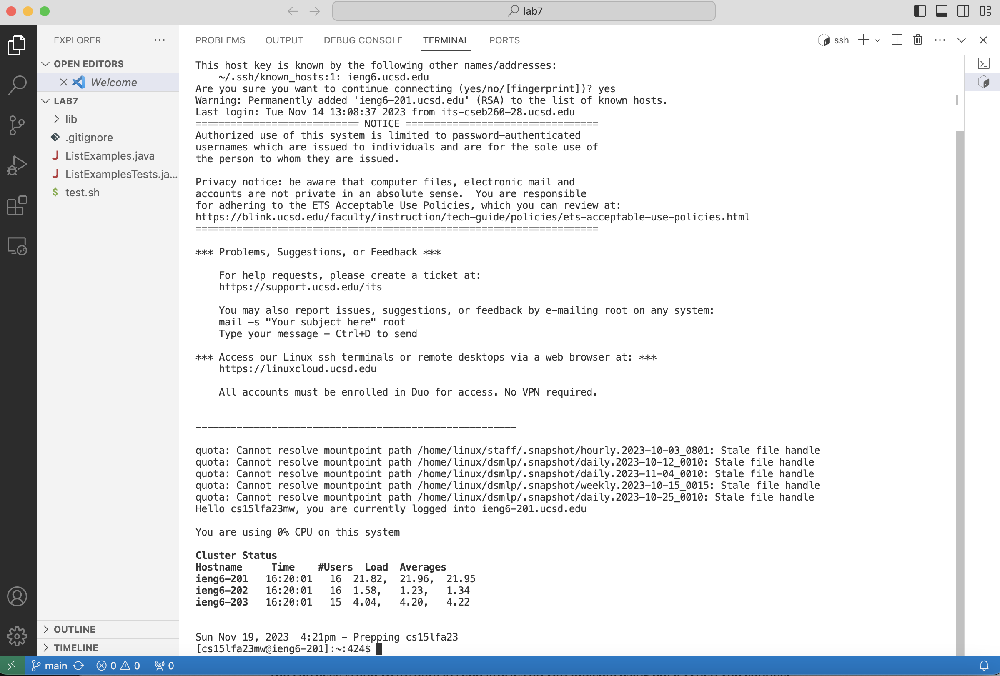
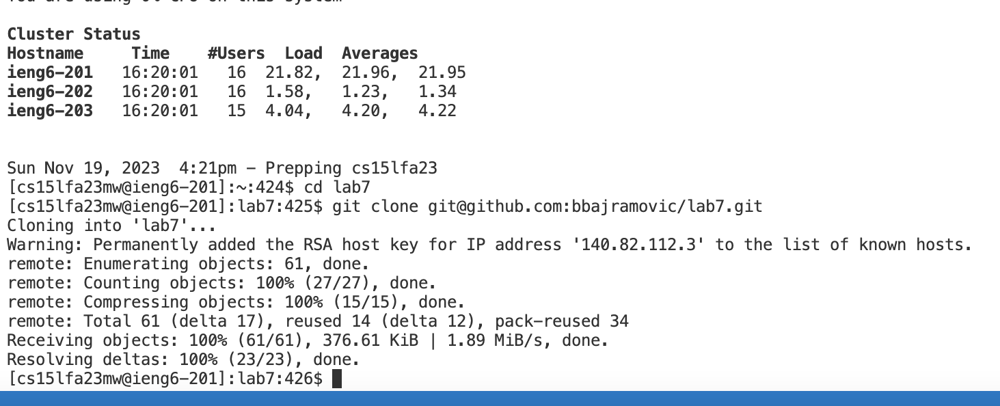
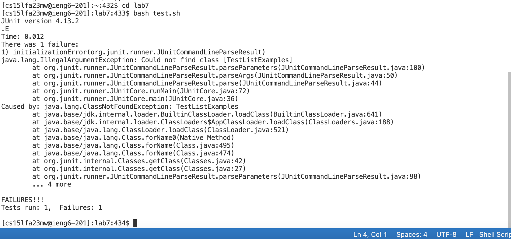
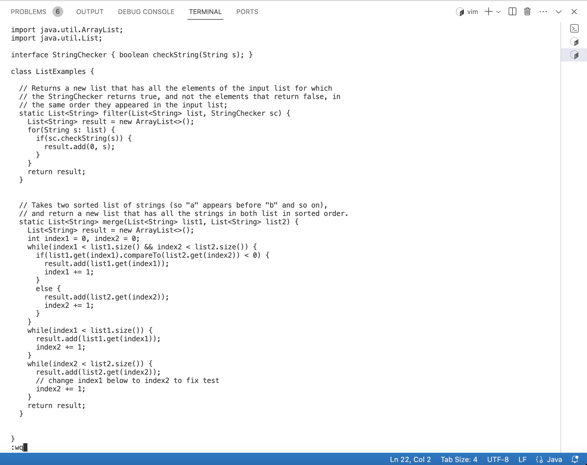
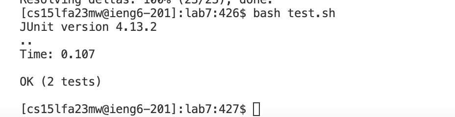
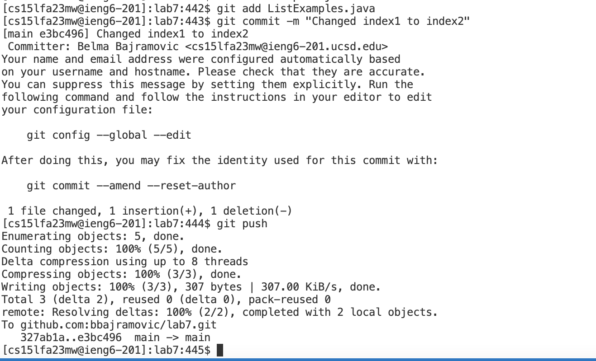

# Part4

To log into ieng6, I had to go into bash terminal, and type `ssh cs15lfa23mw@ieng6-201.ucsd.edu` then `<enter>`, which logged me right away into my account without the password. The ssh command allows us to log into ssh with our username following the command.

# Part 5

To git clone the ssh link, I went to the github website, forked the repository "Lab7", then from my fork, I clicked on the "code" button, and copied the SSH link `<control> + <c>`. In terminal,
I typed the commmand `git clone git@github.com:bbajramovic/lab7.git` and `< enter >` which cloned my forked repository with the SSH link. The `git clone` command, followed by a link to a repository, 
is a git command used to create a copy of a remorte Git repository and copy it to our local machine. 

# Part6

To run the buggy tests, I had to cd into the directory using `cd lab7` then `<enter>` first. Then I ran the command `bash test.sh` and `< enter >` to run the tests. `cd` means "change directory" which changes our current directory into the one that we want to be in to run our commands. `bash` followed by a bash script is a command used to execute a bash script.

# Part7

Here I use the command `vim ListExamples.java` to open up the java file in `vim`. Keys pressed: `</> <i> <n> <d> <e> <x> <1> <enter> <n> <n> <n> <n> <n> <n> <n> <n> <n>` The I pressed  `<rightarrowkey> <i> <delete> <2> <esc> <:> <w> <q> <enter>` Once I execute the `vim` command, I typed /index1 and hit `< enter >` and that automatically took my cursor to the first occurence of "index1". `/` in vim initiates a forward search of whatever string you type into it. Then I hit `<n>` 9 times to get down to the 9th occurence of "index1" in the file which is where I needed to make the change. `n` in vim is a command that allows us to move to the next occurence of a word that we searched with `/`. Then I pressed the `< e >` which is a command in vim that allows us to get to the end of the current word that our cursor is on. Then I pressed the `< rightarrowkey >` to move past the end of the word so that I could delete the last character, "1". Then I pressed `< i >` which is a command in vim that allows us to go into insert mode to make changes into the file. Then I pressed `< delete >` and pressed `< 2 >` to change the `1` to a `2`. Now that I was done making changes, I pressed `< esc >` to go back into normal mode, and execute the command `:wq` in normal mode which allows me to save my changes to the file and leave `vim`. Now I am back in terminal.

# Part8

To re-run the tests, I executed `bash test.sh` which ran the bash script as explained above. 

# Part9

I type the command `git add ListExamples.java` to stage the changes that I wanted to include in this commit, which was the file that I edited. Then I did `git commit -m "Changed index1 to index2"` which is a command that commits our staged changes along with a commit message which is done with `-m`. Then I needed to `git push` to upload the repository content.
