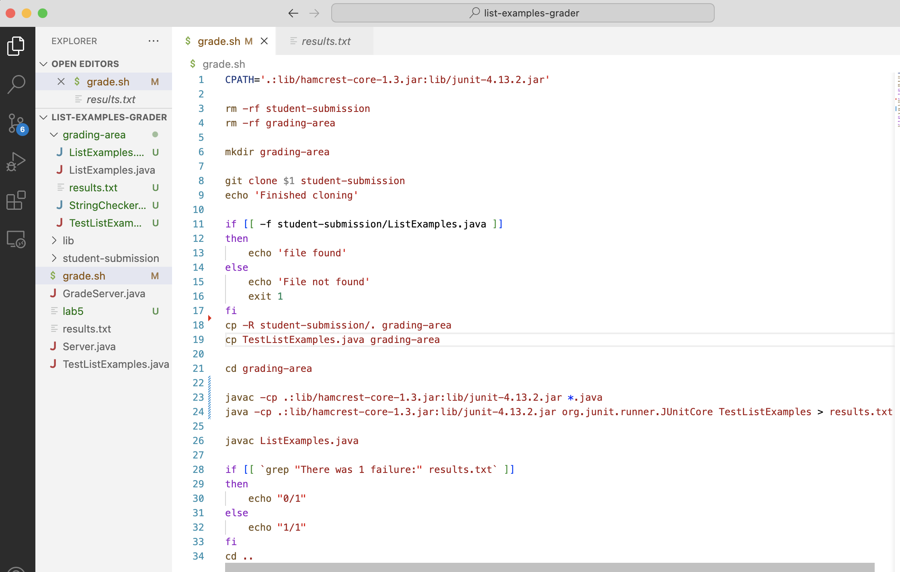
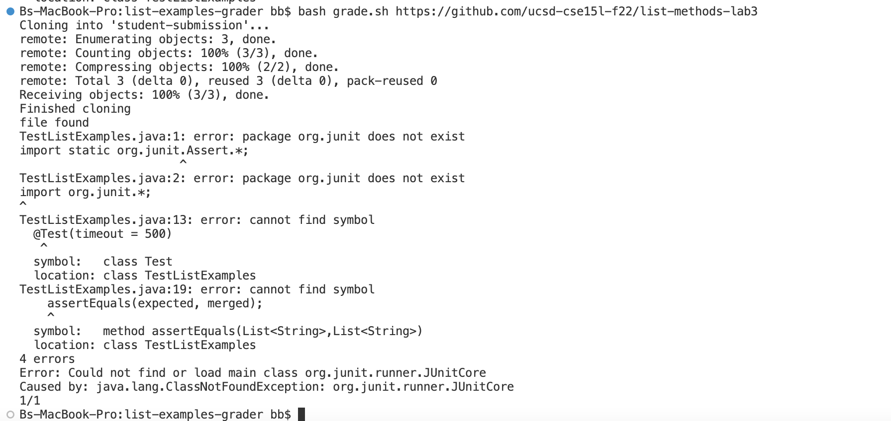
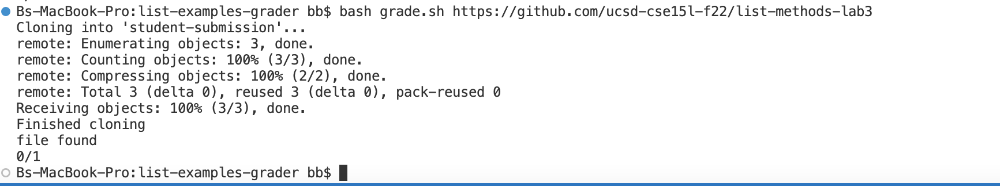
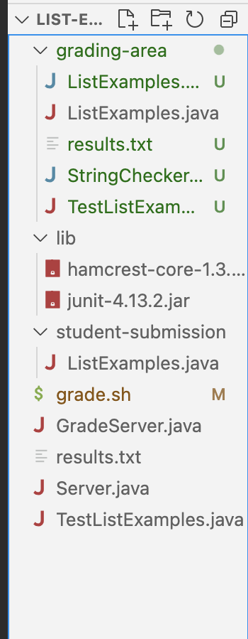
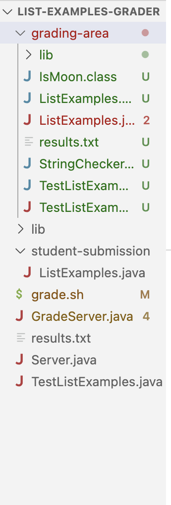

## Student EdStem Post
"Hello, for the lab activity for week 6, my grader is not working properly and I'm not sure why. My output is telling me that I do not have junit, but I correctly compiled
the junit libraries for the test to run. It is showing a 1/1 when it should be a 0/1 for this submission. I think there is a bug with my compilation of the junit libraries"



## TA Response
"What other elements do you need, along with the compiled junit libraries, to be able to run junit? What is the structure of your current directory? Is there anything missing from your current directory?"

## Student Response
"At that point in the bash script, I am currently in the `grading-area` directory, and I realized that I do not have a lib folder within the directory that I am trying to perform
compilations in. The lib folder is where we would have the hamcrest-core file and all junit files, but since I did not have a lib folder, my javac compilation of junit tests could not work.


## Part 4 
# The file & directory structure BEFORE the bug fix:


# The file & directory structure AFTER the bug fix:


# The contents of each file before fixing the bug
Grade.sh : 
```
CPATH='.:lib/hamcrest-core-1.3.jar:lib/junit-4.13.2.jar'

rm -rf student-submission
rm -rf grading-area

mkdir grading-area

git clone $1 student-submission
echo 'Finished cloning'

if [[ -f student-submission/ListExamples.java ]]
then 
    echo 'file found'
else 
    echo 'File not found'
    exit 1
fi
cp -R student-submission/. grading-area
cp TestListExamples.java grading-area

cd grading-area

javac -cp .:lib/hamcrest-core-1.3.jar:lib/junit-4.13.2.jar *.java
java -cp .:lib/hamcrest-core-1.3.jar:lib/junit-4.13.2.jar org.junit.runner.JUnitCore TestListExamples > results.txt

javac ListExamples.java

if [[ `grep "There was 1 failure:" results.txt` ]]
then
    echo "0/1"
else
    echo "1/1"
fi
cd ..
```

results.txt:
```
(The file is empty because the compilation of junit was unsuccessful so there was no results!!!)
```

ListExamples.java:
```
import java.util.ArrayList;
import java.util.List;

interface StringChecker { boolean checkString(String s); }

class ListExamples {

  // Returns a new list that has all the elements of the input list for which
  // the StringChecker returns true, and not the elements that return false, in
  // the same order they appeared in the input list;
  static List<String> filter(List<String> list, StringChecker sc) {
    List<String> result = new ArrayList<>();
    for(String s: list) {
      if(sc.checkString(s)) {
        result.add(0, s);
      }
    }
    return result;
  }


  // Takes two sorted list of strings (so "a" appears before "b" and so on),
  // and return a new list that has all the strings in both list in sorted order.
  static List<String> merge(List<String> list1, List<String> list2) {
    List<String> result = new ArrayList<>();
    int index1 = 0, index2 = 0;
    while(index1 < list1.size() && index2 < list2.size()) {
      if(list1.get(index1).compareTo(list2.get(index2)) < 0) {
        result.add(list1.get(index1));
        index1 += 1;
      }
      else {
        result.add(list2.get(index2));
        index2 += 1;
      }
    }
    while(index1 < list1.size()) {
      result.add(list1.get(index1));
      index1 += 1;
    }
    while(index2 < list2.size()) {
      result.add(list2.get(index2));
      index1 += 1;
    }
    return result;
  }


}
```

TestListExamples.java :
```
import static org.junit.Assert.*;
import org.junit.*;
import java.util.Arrays;
import java.util.List;

class IsMoon implements StringChecker {
  public boolean checkString(String s) {
    return s.equalsIgnoreCase("moon");
  }
}

public class TestListExamples {
  @Test(timeout = 500)
  public void testMergeRightEnd() {
    List<String> left = Arrays.asList("a", "b", "c");
    List<String> right = Arrays.asList("a", "d");
    List<String> merged = ListExamples.merge(left, right);
    List<String> expected = Arrays.asList("a", "a", "b", "c", "d");
    assertEquals(expected, merged);
  }
}
```
GradeServer.java :
```
import java.io.BufferedReader;
import java.io.IOException;
import java.io.InputStream;
import java.io.InputStreamReader;
import java.net.URI;
import java.net.URISyntaxException;
import java.util.Arrays;
import java.util.stream.Stream;

class ExecHelpers {

  /**
    Takes an input stream, reads the full stream, and returns the result as a
    string.

    In Java 9 and later, new String(out.readAllBytes()) would be a better
    option, but using Java 8 for compatibility with ieng6.
  */
  static String streamToString(InputStream out) throws IOException {
    String result = "";
    while(true) {
      int c = out.read();
      if(c == -1) { break; }
      result += (char)c;
    }
    return result;
  }

  /**
    Takes a command, represented as an array of strings as it would by typed at
    the command line, runs it, and returns its combined stdout and stderr as a
    string.
  */
  static String exec(String[] cmd) throws IOException {
    Process p = new ProcessBuilder()
                    .command(Arrays.asList(cmd))
                    .redirectErrorStream(true)
                    .start();
    InputStream outputOfBash = p.getInputStream();
    return String.format("%s\n", streamToString(outputOfBash));
  }

}

class Handler implements URLHandler {
    public String handleRequest(URI url) throws IOException {
       if (url.getPath().equals("/grade")) {
           String[] parameters = url.getQuery().split("=");
           if (parameters[0].equals("repo")) {
               String[] cmd = {"bash", "grade.sh", parameters[1]};
               String result = ExecHelpers.exec(cmd);
               return result;
           }
           else {
               return "Couldn't find query parameter repo";
           }
       }
       else {
           return "Don't know how to handle that path!";
       }
    }
}

class GradeServer {
    public static void main(String[] args) throws IOException {
        if(args.length == 0){
            System.out.println("Missing port number! Try any number between 1024 to 49151");
            return;
        }

        int port = Integer.parseInt(args[0]);

        Server.start(port, new Handler());
    }
}

class ExecExamples {
  public static void main(String[] args) throws IOException {
    String[] cmd1 = {"ls", "lib"};
    System.out.println(ExecHelpers.exec(cmd1));

    String[] cmd2 = {"pwd"};
    System.out.println(ExecHelpers.exec(cmd2));

    String[] cmd3 = {"touch", "a-new-file.txt"};
    System.out.println(ExecHelpers.exec(cmd3));
  }
}
```
Server.java :
```
// A simple web server using Java's built-in HttpServer

// Examples from https://dzone.com/articles/simple-http-server-in-java were useful references

import java.io.IOException;
import java.io.OutputStream;
import java.net.InetSocketAddress;
import java.net.URI;

import com.sun.net.httpserver.HttpExchange;
import com.sun.net.httpserver.HttpHandler;
import com.sun.net.httpserver.HttpServer;

interface URLHandler {
    String handleRequest(URI url) throws IOException;
}

class ServerHttpHandler implements HttpHandler {
    URLHandler handler;
    ServerHttpHandler(URLHandler handler) {
      this.handler = handler;
    }
    public void handle(final HttpExchange exchange) throws IOException {
        // form return body after being handled by program
        try {
            String ret = handler.handleRequest(exchange.getRequestURI());
            // form the return string and write it on the browser
            exchange.sendResponseHeaders(200, ret.getBytes().length);
            OutputStream os = exchange.getResponseBody();
            os.write(ret.getBytes());
            os.close();
        } catch(Exception e) {
            String response = e.toString();
            exchange.sendResponseHeaders(500, response.getBytes().length);
            OutputStream os = exchange.getResponseBody();
            os.write(response.getBytes());
            os.close();
        }
    }
}

public class Server {
    public static void start(int port, URLHandler handler) throws IOException {
        HttpServer server = HttpServer.create(new InetSocketAddress(port), 0);

        //create request entrypoint
        server.createContext("/", new ServerHttpHandler(handler));

        //start the server
        server.start();
        System.out.println("Server Started! Visit http://localhost:" + port + " to visit.");
    }
}
```
# The full command line (or lines) you ran to trigger the bug
```
cd list-examples-grader
bash grade.sh https://github.com/ucsd-cse15l-f22/list-methods-lab3
```

# A description of what to edit to fix the bug

The bug, as explained above, was that we were missing the library folder in our `grading-area` directory, which meant that our junit tests could not compile correctly. To fix this,
I added the line `cp -R lib grading-area` to the bash script right underneath `cp TestListExamples.java grading-area` so that we would have the library folder in our  `grading-area` directory
before we did our `javac` commands for junit. Discovering this bug is a little tricky by just only looking at the output of the error message. The error message is basically telling us that 
the program cannot find the junit classes and that org.junit does not exist. A student would potentially be able to discover the bug by looking at what a succesful compliation of org.junit
looks like in a directory structure, and compare it to their current directory structure, and notice that they do not have a lib folder where the org.junit .jar file is supposed to be.

## Part 2 Reflection
During the second half of our quarter, I was first introduced to bash and bash scripts. This opened up so many different windows for me as I discovered how bash scripts are basically 
files that automate tasks. VIM was also something very interesting to learn about. It has so many different keyboard shortcuts that are important to memorize to be able to navigate efficiently.
We're also able to navigate through so much more and make direct changes to files through a terminal with VIM. Although difficult at times, I definitely learned a lot this quarter.

